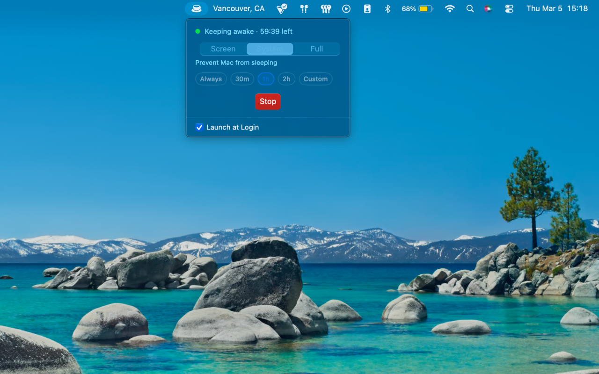
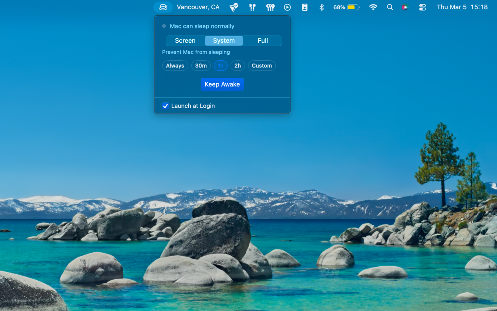

<div align="center">
  
  <h1>Moka</h1>
</div>

<p align="center">
  <a href="https://github.com/zekevh/moka/releases/latest"></a>
  
  
  
</p>

Your Mac, wide awake.

<p align="center">
  
  
</p>

## Install

```sh
brew install --cask zekevh/tap/moka
```

Or [download the DMG](https://github.com/zekevh/moka/releases/latest).

## Features

- Full caffeinate control — display, idle, disk, and system assertions
- Live countdown timer visible directly in the menu bar
- CLI-aware — detects and adopts external caffeinate processes
- Battery smart — system sleep toggle auto-disables on battery
- Native Swift — no Electron, no background processes
- Universal binary: Apple Silicon + Intel

## You may also like

- [Whereabouts](https://github.com/zekevh/whereabouts) — know where your connection is
- [Crest](https://github.com/zekevh/crest) — your watchlist in the menu bar

## License

MIT © [Zeke V. Holt](https://zvh.io)
